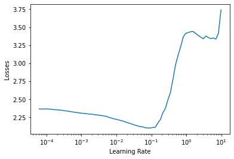

# S11-Assignment-Solution

1. Write a code that draws this curve (without the arrows). In submission, you'll upload your drawn curve and code for that.
2. Write a code which
   1. uses this new ResNet Architecture for Cifar10:
      1. PrepLayer - Conv 3x3 s1, p1) >> BN >> RELU [64k]
      2. Layer1 -
         1. X = Conv 3x3 (s1, p1) >> MaxPool2D >> BN >> RELU [128k]
         2. R1 = ResBlock( (Conv-BN-ReLU-Conv-BN-ReLU))(X) [128k] 
         3. Add(X, R1)
      3. Layer 2 -
         1. Conv 3x3 [256k]
         2. MaxPooling2D
         3. BN
         4. ReLU
      4. Layer 3 -
         1. X = Conv 3x3 (s1, p1) >> MaxPool2D >> BN >> RELU [512k]
         2. R2 = ResBlock( (Conv-BN-ReLU-Conv-BN-ReLU))(X) [512k]
         3. Add(X, R2)
      5. MaxPooling with Kernel Size 4
      6. FC Layer 
      7. SoftMax
   2. Uses One Cycle Policy such that:
      1. Total Epochs = 24
      2. Max at Epoch = 5
      3. LRMIN = FIND
      4. LRMAX = FIND
      5. NO Annihilation
   3. Uses this transform -RandomCrop 32, 32 (after padding of 4) >> FlipLR >> Followed by CutOut(8, 8)
   4. Batch size = 512
   5. Target Accuracy: 90%. 
   6. The lesser the modular your code is (i.e. more the code you have written in your Colab file), less marks you'd get. 
3. Questions asked are:
   1. Upload the code you used to draw your ZIGZAG or CYCLIC TRIANGLE plot.
   2. Upload your triangle Plot which was drawn with your code.
   3. Upload the link to your GitHub copy of Colab Code. 
   4. Upload the github link for the model as described in A11. 
   5. What is your test accuracy?

## Solution:

- lr_range_test.py : has the logic for running learning rate range test. The min loss was found at lr = 0.0931.

- 

- The model was trained using One Cycle Policy. The code used is in OneCycle.py

  

- For the 24th epoch training accuracy was 49.17% and validation accuracy was 49.27%.

  

