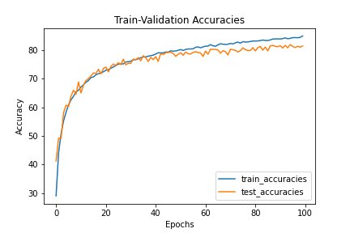

# S7-Assignment-Solution

### Assignment 7

1. Run this [network](https://colab.research.google.com/drive/1qlewMtxcAJT6fIJdmMh8pSf2e-dh51Rw).  
2. Fix the network above:
   1. change the code such that it uses GPU
   2. change the architecture to C1C2C3C40 (basically 3 MPs)
   3. total RF must be more than 44
   4. one of the layers must use Depthwise Separable Convolution
   5. one of the layers must use Dilated Convolution
   6. use GAP (compulsory):- add FC after GAP to target #of classes (optional)
   7. achieve 80% accuracy, as many epochs as you want. Total Params to be less than 1M. 
   8. upload to Github
   9. Attempt S7-Assignment Solution

## Solution:

1. The first 2 layers used had dilated convolution.

2. The other convolutions except the last layer were depth wise separable convolutions.

3. The RF for the model , as calculated using the old formula is 100 before the GAP layer.

4. GAP is used.

5. Trained for 100 epochs.

6. The last validation accuracy obtained is 81.47% after being trained for 100 epochs.

7. The number of parameters is 149696.

   