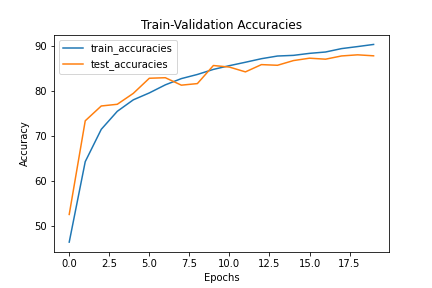

# S8-Assignment-Solution

1. Assignment: 

   1. Go through this repository: https://github.com/kuangliu/pytorch-cifar
   2. Extract the ResNet18 model from this repository and add it to your API/repo. 
   3. Use your data loader, model loading, train, and test code to train ResNet18 on Cifar10
   4. Your Target is 85% accuracy. No limit on the number of epochs. Use default ResNet18 code (so params are fixed). 
   5. Once done finish S8-Assignment-Solution. 

    

   These are the questions in S8-A-S

   1. Share the link to your GitHub S8 code. Please make sure it is public. If your code is not modular or structured into different functional files, you will get 0 for the whole submission.
   2. What is the final accuracy of your model
   3. Paste your training or epoch logs here

## Solution:

1. resnet.py : This python file has the logic for implementing Resnet models, including resnet18 which is used in this solution.

2. data_loader.py : This file has the logic to load the CIFAR-10 dataset. It also applies some transforms for image augmentation.

3. cifar10_trainer.py : This python file has the train and test methods which train the model uisng the given dataset and measures the performance on a test set.

4. The model used is Resnet-18. It has 11,173,962 parameters.

5. Trained for 20 epochs.

6. The last validation accuracy obtained is 87.86%.

   

Training logs:

EPOCH: 1
Train set: Average loss: 0.0148, Accuracy: 23172/50000 (46.34%)
Test set: Average loss: 0.0131, Accuracy: 5251/10000 (52.51%)
EPOCH: 2
Train set: Average loss: 0.0101, Accuracy: 32137/50000 (64.27%)
Test set: Average loss: 0.0076, Accuracy: 7338/10000 (73.38%)
EPOCH: 3
Train set: Average loss: 0.0081, Accuracy: 35738/50000 (71.48%)
Test set: Average loss: 0.0067, Accuracy: 7668/10000 (76.68%)
EPOCH: 4
Train set: Average loss: 0.0071, Accuracy: 37745/50000 (75.49%)
Test set: Average loss: 0.0066, Accuracy: 7706/10000 (77.06%)
EPOCH: 5
Train set: Average loss: 0.0063, Accuracy: 39025/50000 (78.05%)
Test set: Average loss: 0.0063, Accuracy: 7949/10000 (79.49%)
EPOCH: 6
Train set: Average loss: 0.0058, Accuracy: 39795/50000 (79.59%)
Test set: Average loss: 0.0050, Accuracy: 8286/10000 (82.86%)
EPOCH: 7
Train set: Average loss: 0.0053, Accuracy: 40695/50000 (81.39%)
Test set: Average loss: 0.0051, Accuracy: 8298/10000 (82.98%)
EPOCH: 8
Train set: Average loss: 0.0049, Accuracy: 41391/50000 (82.78%)
Test set: Average loss: 0.0055, Accuracy: 8132/10000 (81.32%)
EPOCH: 9
Train set: Average loss: 0.0046, Accuracy: 41852/50000 (83.70%)
Test set: Average loss: 0.0055, Accuracy: 8167/10000 (81.67%)
EPOCH: 10
Train set: Average loss: 0.0044, Accuracy: 42416/50000 (84.83%)
Test set: Average loss: 0.0042, Accuracy: 8570/10000 (85.70%)
Saving the model for at /content/gdrive/MyDrive/EVA5/S8AssignmentSolution/cifar_10_epoch_10.pth.
EPOCH: 11
Train set: Average loss: 0.0041, Accuracy: 42832/50000 (85.66%)
Test set: Average loss: 0.0045, Accuracy: 8535/10000 (85.35%)
EPOCH: 12
Train set: Average loss: 0.0039, Accuracy: 43213/50000 (86.43%)
Test set: Average loss: 0.0048, Accuracy: 8428/10000 (84.28%)
EPOCH: 13
Train set: Average loss: 0.0037, Accuracy: 43609/50000 (87.22%)
Test set: Average loss: 0.0042, Accuracy: 8590/10000 (85.90%)
EPOCH: 14
Train set: Average loss: 0.0035, Accuracy: 43906/50000 (87.81%)
Test set: Average loss: 0.0042, Accuracy: 8575/10000 (85.75%)
EPOCH: 15
Train set: Average loss: 0.0034, Accuracy: 43981/50000 (87.96%)
Test set: Average loss: 0.0038, Accuracy: 8680/10000 (86.80%)
EPOCH: 16
Train set: Average loss: 0.0033, Accuracy: 44203/50000 (88.41%)
Test set: Average loss: 0.0038, Accuracy: 8733/10000 (87.33%)
EPOCH: 17
Train set: Average loss: 0.0032, Accuracy: 44354/50000 (88.71%)
Test set: Average loss: 0.0039, Accuracy: 8711/10000 (87.11%)
EPOCH: 18
Train set: Average loss: 0.0030, Accuracy: 44733/50000 (89.47%)
Test set: Average loss: 0.0036, Accuracy: 8783/10000 (87.83%)
EPOCH: 19
Train set: Average loss: 0.0029, Accuracy: 44959/50000 (89.92%)
Test set: Average loss: 0.0036, Accuracy: 8808/10000 (88.08%)
EPOCH: 20
Train set: Average loss: 0.0028, Accuracy: 45197/50000 (90.39%)
Test set: Average loss: 0.0037, Accuracy: 8786/10000 (87.86%)
Saving the model for at /content/gdrive/MyDrive/EVA5/S8AssignmentSolution/cifar_10_epoch_20.pth.