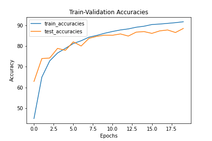

# S9-Assignment-Solution

**Assignment**:

1. Move your last code's transformations to Albumentations. Apply ToTensor, HorizontalFlip, Normalize (at min) + More (for additional points)
2. Please make sure that your test_transforms are simple and only using ToTensor and Normalize
3. Implement GradCam function as a module. 
4. Your final code (notebook file) must use imported functions to implement transformations and GradCam functionality
5. Target Accuracy is 87%
6. Submit answers to S9-Assignment-Solution. 

Questions asked in S9-Assignment-Solution are:

1. Paste your Albumentation File Code
2. Paste your GradCam Module's code
3. Paste your notebook file code
4. What is your final Validation Accuracy?
5. Share the link to your Repo.

If there are errors/misrepresentations in Repo, the whole submission would be marked 0. 

## Solution:

1. resnet.py : This python file has the logic for implementing Resnet models, including resnet18 which is used in this solution.

2. data_loader.py : This file has the logic to load the CIFAR-10 dataset. It also applies some transforms for image augmentation.

3. cifar10_trainer.py : This python file has the train and test methods which train the model using the given dataset and measures the performance on a test set.

4. dataset.py : A custom dataset class to handle albumentations

5. image_augmentations.py : This contains the train and test augmentations using albumentations.

6. gradcam.py:  Implementation of gradient cam from [here](https://github.com/jacobgil/pytorch-grad-cam/blob/6c83c8fe98f76f0e37ed58bc234ea623c61e29cc/gradcam.py)

7. The model used is Resnet-18. It has 11,173,962 parameters.

8. Trained for 20 epochs.

9. The last validation accuracy obtained is 88.60%.

   

Training logs:

EPOCH: 1   

Train set: Average loss: 0.0151, Accuracy: 22452/50000 (44.90%)  

Test set: Average loss: 0.0105, Accuracy: 6290/10000 (62.90%)   

EPOCH: 2   

Train set: Average loss: 0.0099, Accuracy: 32478/50000 (64.96%)   

Test set: Average loss: 0.0075, Accuracy: 7399/10000 (73.99%)   

EPOCH: 3   

Train set: Average loss: 0.0077, Accuracy: 36423/50000 (72.85%)   

Test set: Average loss: 0.0073, Accuracy: 7427/10000 (74.27%)   

EPOCH: 4   

Train set: Average loss: 0.0067, Accuracy: 38348/50000 (76.70%)   

Test set: Average loss: 0.0062, Accuracy: 7893/10000 (78.93%)  

EPOCH: 5 Train set: Average loss: 0.0060, Accuracy: 39476/50000 (78.95%)   

Test set: Average loss: 0.0066, Accuracy: 7800/10000 (78.00%)   

EPOCH: 6 Train set: Average loss: 0.0054, Accuracy: 40641/50000 (81.28%)   

Test set: Average loss: 0.0051, Accuracy: 8211/10000 (82.11%)   

EPOCH: 7 Train set: Average loss: 0.0049, Accuracy: 41318/50000 (82.64%)   

Test set: Average loss: 0.0061, Accuracy: 8010/10000 (80.10%)   

EPOCH: 8 Train set: Average loss: 0.0045, Accuracy: 42190/50000 (84.38%)   

Test set: Average loss: 0.0048, Accuracy: 8381/10000 (83.81%)  

EPOCH: 9   

Train set: Average loss: 0.0042, Accuracy: 42621/50000 (85.24%)   

Test set: Average loss: 0.0045, Accuracy: 8479/10000 (84.79%)   

EPOCH: 10   

Train set: Average loss: 0.0039, Accuracy: 43142/50000 (86.28%)   

Test set: Average loss: 0.0043, Accuracy: 8535/10000 (85.35%)   

Saving the model for at /content/gdrive/MyDrive/EVA5/S9AssignmentSolution/cifar_10_epoch_10.pth.   

EPOCH: 11 Train set: Average loss: 0.0037, Accuracy: 43572/50000 (87.14%)   

Test set: Average loss: 0.0046, Accuracy: 8531/10000 (85.31%)   

EPOCH: 12   

Train set: Average loss: 0.0035, Accuracy: 43941/50000 (87.88%)   

Test set: Average loss: 0.0041, Accuracy: 8595/10000 (85.95%)   

EPOCH: 13 Train set: Average loss: 0.0033, Accuracy: 44193/50000 (88.39%)   

Test set: Average loss: 0.0046, Accuracy: 8492/10000 (84.92%)   

EPOCH: 14   

Train set: Average loss: 0.0031, Accuracy: 44599/50000 (89.20%)   

Test set: Average loss: 0.0039, Accuracy: 8682/10000 (86.82%)   

EPOCH: 15   

Train set: Average loss: 0.0029, Accuracy: 44847/50000 (89.69%)   

Test set: Average loss: 0.0040, Accuracy: 8709/10000 (87.09%)   

EPOCH: 16   

Train set: Average loss: 0.0028, Accuracy: 45253/50000 (90.51%)   

Test set: Average loss: 0.0043, Accuracy: 8622/10000 (86.22%)   

EPOCH: 17   

Train set: Average loss: 0.0027, Accuracy: 45374/50000 (90.75%)   

Test set: Average loss: 0.0040, Accuracy: 8743/10000 (87.43%)   

EPOCH: 18   

Train set: Average loss: 0.0025, Accuracy: 45537/50000 (91.07%)   

Test set: Average loss: 0.0038, Accuracy: 8787/10000 (87.87%)   

EPOCH: 19   

Train set: Average loss: 0.0024, Accuracy: 45710/50000 (91.42%)   

Test set: Average loss: 0.0044, Accuracy: 8664/10000 (86.64%)   

EPOCH: 20   

Train set: Average loss: 0.0023, Accuracy: 45928/50000 (91.86%)  

Test set: Average loss: 0.0037, Accuracy: 8860/10000 (88.60%)   

Saving the model for at /content/gdrive/MyDrive/EVA5/S9AssignmentSolution/cifar_10_epoch_20.pth.